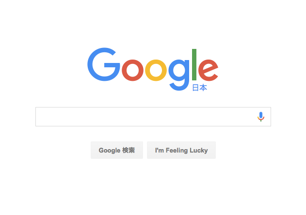
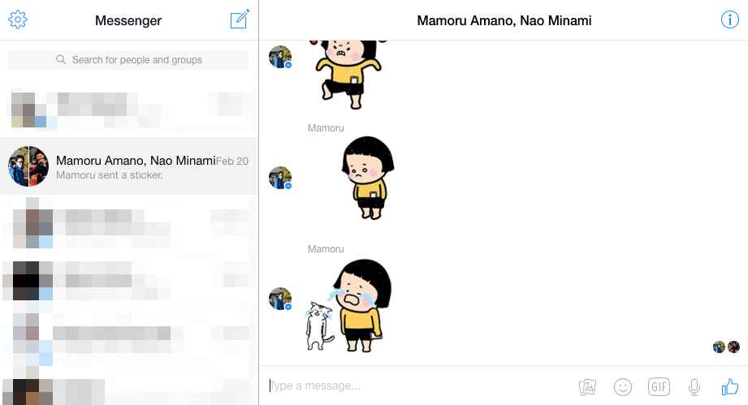
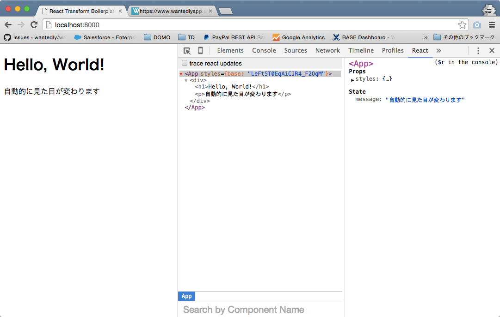

## React

Reactは、Facebookが開発したUIを開発するためのライブラリ。
複雑な挙動のウェブアプリケーションを分かりやすく記述できる。

## Reactの基本

Reactの主役は、Component。

Componentとは、**状態(State)** と **見た目(View)** をひとまとまりにしたもの。


## 状態(State)

例えば、以下のようなものが状態と呼ばれる。

### Google



状態は、ユーザーが入力したキーワード。

### Facebook Messenger



状態は、入力しているメッセージ、選んだ画像、現在のグループのメッセージ、選択しているグループ、全グループ、グループ検索バーの入力値、既読情報など。

このように、複雑なアプリケーションは、多くの状態で構成されていて、**ユーザーのアクション(クリックや入力)や、リアルタイムなアプリケーションの場合は他のユーザーのアクションなどによって変化する**。

## 見た目(View)

状態が決まると、見た目は一意に決定される。

「**今の状態がこうだから、見た目はこうなるべき**」と考えて、それを記述する。
「状態がこう変わったから、それに応じてビューをこうやって変更しよう」とか、状態の遷移は考える必要がない。

## Component

`src/App.js`にシンプルなComponentが定義してある。

`this.state`に状態が保持されていて、`render()`メソッドでその状態の時の見た目を定義している。

```
import React, { Component } from 'react'

class App extends Component {
  constructor(props) {
    super(props)
    // 状態の定義
    this.state = { message: "Reactのシンプルなコンポーネントです" }
  }

  render() {
    // 見た目の定義
    return(
      <div>
        <h1>Hello, World!</h1>
        <p>{ this.state.message }</p>
      </div>
    )
  }
}
```

## React Developer Tools

状態が変わると見た目が変わる様子を確認するのに、[React Developer Tools](https://chrome.google.com/webstore/detail/react-developer-tools/fmkadmapgofadopljbjfkapdkoienihi)が便利。
Chromeの開発者ツールからComponentのStateを変更することができる。



stateを手動で変更すると、Viewが自動的に変わることが確認できる。


## 開発の流れ

基本的には以下のような流れで開発していく

- ページをどのようなComponentに切り分けるか大まかに決める
- Componentが持つ状態を考える
 - スイッチのon/offや、入力されたテキストなど。
- 見た目を実装する
- アクション等による状態の変更を実装する
